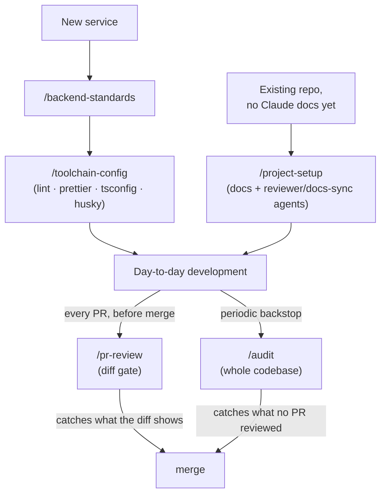

# Claude Code skills — backend

Shared Claude Code skills for backend engineering. Internal.

**Author and maintainer:** Youssef Farag ([@YoussefRashad](https://github.com/YoussefRashad)),
Head of Backend Engineering. Changes to the standards, the source templates or the toolchain
baseline go through review — see [`.github/CODEOWNERS`](.github/CODEOWNERS).

**Team standards** — opinionated, NestJS-specific, authored and maintained here:

| Skill                                     | Version | What it does                                                                                                                                            |
| ----------------------------------------- | ------- | ------------------------------------------------------------------------------------------------------------------------------------------------------- |
| [`backend-standards`](backend-standards/) | 2.0.1   | Scaffolds a new backend service on the team standards, or brings an existing one onto them. Ships the standards as files plus working source templates. |
| [`toolchain-config`](toolchain-config/)   | 2.0.0   | ESLint, Prettier, tsconfig, Husky, lint-staged — one reviewed baseline.                                                                                 |

**These two are a pair.** `backend-standards` deliberately does not ship lint or compiler
config — that belongs to `toolchain-config`, because two skills shipping the same eslint
config is how the two copies drift apart. Install both (see `ADR-001`).

**General-purpose** — framework-agnostic, authored here too:

| Skill                             | What it does                                                                                                |
| --------------------------------- | ----------------------------------------------------------------------------------------------------------- |
| [`project-setup`](project-setup/) | Generates Claude Code docs + reviewer/docs-sync agents for any backend repo, from the actual code.          |
| [`pr-review`](pr-review/)         | Multi-lane review of one PR/diff — automated security/dependency/secret scans plus a quality pass.          |
| [`audit`](audit/)                 | Full-codebase security safety-net; persists a trackable report. The backstop when a PR skipped `pr-review`. |

These three overlap in places with `backend-standards` (which ships its own reviewer and
docs-sync agents, and is what `project-setup` reverse-engineers). Use whichever fits — see
`backend-standards/SKILL.md` § "Relationship to the other review skills".

---

## Install

```bash
git clone https://github.com/YoussefRashad/claude-backend-skills.git ~/claude-backend-skills
mkdir -p ~/.claude/skills
cp -r ~/claude-backend-skills/backend-standards ~/.claude/skills/
cp -r ~/claude-backend-skills/toolchain-config  ~/.claude/skills/
cp -r ~/claude-backend-skills/pr-review         ~/.claude/skills/
cp -r ~/claude-backend-skills/audit             ~/.claude/skills/
```

On Windows, `~/.claude/skills` is `C:\Users\<you>\.claude\skills\`.

`project-setup` (2.0.0, shared by Claude Code and Codex) is **not** copied with `cp`: it has its own
installer, which verifies the copy, keeps backups and refuses to overwrite an older unversioned copy
without consent. Retire v1 first (see `project-setup/references/claude.md` "Retiring v1"), then:

```bash
node ~/claude-backend-skills/project-setup/install/install.mjs --dry-run
node ~/claude-backend-skills/project-setup/install/install.mjs            # add --replace-unversioned to replace a v1 copy (backed up)
node ~/claude-backend-skills/project-setup/install/install.mjs verify
```

See `project-setup/README.md` and `project-setup/RELEASE-NOTES-2.0.0.md` (known limitations).

Start a new Claude Code session and check they appear:

```
/backend-standards
/toolchain-config
/project-setup
/pr-review
/audit
```

If a skill does not show up, confirm `SKILL.md` sits directly inside its folder — not one
level deeper.

### Updating

```bash
cd ~/claude-backend-skills && git pull
cp -r backend-standards toolchain-config pr-review audit ~/.claude/skills/
node project-setup/install/install.mjs && node project-setup/install/install.mjs verify
```

---

## Use

Once installed, invoke a skill two ways: **explicitly** with `/<name>`
(`/backend-standards`, `/pr-review`, `/audit`), or with a **natural-language** request that
matches its trigger. The `<name>` is the skill's `name:` field, not its folder.

For a step-by-step guide to each skill — arguments, flags, and the `audit` options — see
**[`USAGE.md`](USAGE.md)**.

### Where each skill fits



### Quick reference

| Want to…                                           | Skill               | Say                                        |
| -------------------------------------------------- | ------------------- | ------------------------------------------ |
| Start a new NestJS service on the standard         | `backend-standards` | "create a new backend service for `<X>`"   |
| Bring an existing service onto the standard        | `backend-standards` | "apply our backend standards to this repo" |
| Unify ESLint / Prettier / tsconfig / Husky         | `toolchain-config`  | "unify the eslint config in this repo"     |
| Generate Claude docs + agents for an existing repo | `project-setup`     | `/project-setup`                           |
| Review a PR / diff before merge                    | `pr-review`         | `/pr-review <PR-url \| branch \| paths>`   |
| Security-scan the whole codebase                   | `audit`             | `/audit` (or `/audit --full`)              |

**New service** (`backend-standards`) asks what it cannot guess — sensitivity, versioning
strategy, whether a released mobile client is involved, which external systems it calls —
then scaffolds the project, installs the dependencies, applies the toolchain, copies the
standards and source templates, and runs every gate.

**Existing service** (`backend-standards`, "apply…") is a more cautious job: it documents
what the project **actually is** into `.ai/standards/03-project-architecture.md`, records
intentional differences in `known-deviations.md`, and installs the two review agents. It
does **not** rewrite working code — a mismatch between the standard and a working codebase
is information to report, not a defect to fix.

**`pr-review` vs `audit`:** `pr-review` gates one diff before merge; `audit` sweeps the
whole codebase as a periodic backstop for whatever no PR reviewed. See `USAGE.md` for the
`audit` modes (`--full`, `--path`, `--since`).

---

## Propagation is pull-based

Nothing is pushed to a project. A repository silently falls behind until someone re-runs the
skill on it.

Each project carries two stamps:

| File                                                                        | Written by          |
| --------------------------------------------------------------------------- | ------------------- |
| `CLAUDE.md` — "Applied from the `backend-standards` skill, version `x.y.z`" | `backend-standards` |
| `.backend-standards.json`                                                   | `backend-standards` |
| `.toolchain-config.json`                                                    | `toolchain-config`  |

Compare those against the `templates/version.json` in each skill here to find what is behind.

---

## Versioning these skills

Bump `templates/version.json` in a skill whenever you change anything a project would
receive — a rule, a template, a dependency default. The stamp is the only way anyone can
tell a stale project from a current one, and a stamp that does not move is worse than none.

| Bump      | When                                                                                                                                                  |
| --------- | ----------------------------------------------------------------------------------------------------------------------------------------------------- |
| **Major** | A project re-syncing would have to change code, or could break: a renamed export, a compiler option that alters emit, a lint rule promoted to `error` |
| **Minor** | Additive: a new template, a new section, a new optional rule                                                                                          |
| **Patch** | Wording, typos, a clarified comment with no behavioural change                                                                                        |

`lastVerified` in the same file records when the pinned dependency versions were last
checked against the registry (`npm outdated`). The pins are **deliberately held** behind
several current majors — see the currency table in
[`toolchain-config/templates/package-fragments.md`](toolchain-config/templates/package-fragments.md).
Moving them is its own validated initiative, not a toolchain sweep.

Keep the source templates **prettier-clean against the canonical `.prettierrc`**. They were
formatted at source deliberately: an unformatted template means every new project starts
with a failing `format:check`. This is now checked mechanically rather than remembered:

```bash
npm ci && npm run check
```

CI runs the same thing, plus a guard that fails a pull request touching `*/templates/**`
or `*/references/**` without bumping that skill's `version.json`.

---

## Before sharing externally

These files carry internal material. Read before any of it is shared:

- **`backend-standards/references/02-security-and-compliance.md`** describes the logging
  posture in detail — that OTPs, access and refresh tokens, national IDs and card tokens are
  logged in full, and the four conditions that decision rests on (no API reads the log store,
  restricted access, 90-day retention, no lower-trust replication). That is an accurate map
  of what is stored, where, and what protects it.
- Four owner-signed decisions carrying a name and date, in `01`, `02` and `SKILL.md`.
- References to internal service names, PDPL, and the PCI position on PAN and CVV.

For external sharing, produce a fork with `02` stripped of the environment-specific
conditions and the signed decisions removed. `01`, the source templates and both agents are
already generic.

---

## Repository layout

```
claude-backend-skills/
├── backend-standards/
│   ├── SKILL.md                 the procedure — 12 steps
│   ├── README.md                install notes
│   ├── references/              the standards, copied into every project
│   │   ├── 00-ai-agent-instructions.md
│   │   ├── 01-engineering-standards.md
│   │   ├── 02-security-and-compliance.md
│   │   └── 04-review-and-dod.md
│   └── templates/
│       ├── version.json
│       ├── docs/                CLAUDE.md · 03-project-architecture · known-deviations
│       ├── agents/              reviewer · docs-sync
│       ├── src/                 16 working TypeScript files (3 of them specs)
│       └── ci/                  GitHub Actions workflow — the 04 Part A gates
├── toolchain-config/
│   ├── SKILL.md
│   └── templates/               eslint · prettier · tsconfig · husky · security-scan
├── project-setup/               general-purpose — shared Claude Code + Codex setup (2.0.0, own installer and tests)
├── pr-review/SKILL.md           general-purpose — per-PR multi-lane review
└── audit/SKILL.md               general-purpose — full-codebase safety net
```

### Why source templates rather than descriptions

A description of `AbstractEntity` drifts from the real `AbstractEntity`. A file does not.
Each template enforces one rule that is easy to get wrong and expensive to get wrong late:

| File                                            | What it prevents                                                                                                                                                            |
| ----------------------------------------------- | --------------------------------------------------------------------------------------------------------------------------------------------------------------------------- |
| `money.util.ts` + `.spec.ts`                    | Float drift when amounts accumulate. Exact, zero dependencies, with the 18 tests that prove it — including that a refund rounds the same distance as the charge it reverses |
| `redis-lock.service.ts`                         | Releasing a lock you no longer own; running unguarded when Redis is down                                                                                                    |
| `webhook-signature.util.ts`                     | Mutating state before verifying a provider signature                                                                                                                        |
| `sortable.ts` + `.spec.ts`                      | SQL injection through a sort parameter — including `?sortBy=toString`, which walks the prototype chain past a naive truthiness check                                        |
| `correlation-id.middleware.ts`                  | An untrusted trace header written straight into a log column; a correlation ID the logger cannot reach                                                                      |
| `rate-limit.ts`                                 | A service that ships violating `02` §9 from its first commit                                                                                                                |
| `base.axios.ts`                                 | An HTTP client with no timeout — it throws at construction                                                                                                                  |
| `pagination.dto.ts`                             | An uncapped page size                                                                                                                                                       |
| `response-envelope.interceptor.ts` + `.spec.ts` | A `POST` returning HTTP 201 with `"statusCode": 200` in the body                                                                                                            |
| `all-exceptions.filter.ts`                      | Five error shapes instead of one                                                                                                                                            |
| `abstract.entity.ts`                            | An entity with no primary key                                                                                                                                               |

### What has actually been verified

Stated precisely, because "validated" without a scope is how a stale claim survives.

**Verified on 2026-09-20, by running it:**

- `money.util.ts` — 38 assertions pass standalone under Node, covering every case in the
  spec plus the new negative-rounding ones.
- `sortable.ts` — the allowlist rejects `toString`, `constructor`, `valueOf`,
  `hasOwnProperty`, `__proto__` and `isPrototypeOf`. The previous implementation returned
  `function toString() { [native code] }` into `ORDER BY` for the first of those.
- `eslint.config.mjs` — loads under the canonical pins; all four `no-restricted-syntax`
  selectors fire on the violations and on none of the correct forms (`@Body() dto: Dto`,
  ``qb.where(`id = :id`, { id })``).
- `emitDecoratorMetadata` — a value import emits `design:paramtypes: [Redis]`; an
  `import type` emits `[Function]`, which is why `consistent-type-imports` is off.

**Verified end-to-end on 2026-09-20**, by scaffolding a throwaway service on Nest 11 and running the whole procedure — `nest new`, install, all seven Part A gates, and boot:

| Gate       | Result                                                                                |
| ---------- | ------------------------------------------------------------------------------------- |
| Lint       | 0 errors, 0 warnings                                                                  |
| Type check | 0 errors — specs included                                                             |
| Format     | clean                                                                                 |
| Tests      | 35 passed, 4 suites                                                                   |
| Build      | pass                                                                                  |
| Boot       | starts and serves; a missing `ALLOWED_ORIGINS` fails the boot loudly, as §15 requires |

Live behaviour confirmed against the running service: a `POST` returns HTTP 201 with `"statusCode": 201` in the body, and `@HttpCode(202)` returns 202/202; a malformed `x-correlation-id` is replaced rather than echoed; the throttler allows 10 requests then returns 429; every error leaves through one envelope shape.

Removing `esModuleInterop` and rebuilding reproduces the original defect exactly: the build still succeeds, and boot throws `TypeError: (0 , compression_1.default) is not a function`. That is why booting is now part of the procedure rather than implied by a green build.

**Not supported: Nest 12.** An unpinned `npx @nestjs/cli new` now resolves to 12.x, which generates oxlint, Vitest, `nodenext` module resolution and `strict` — none of which these templates target. Step 1 pins the CLI to 11; see the **Nest 12** section in [`backend-standards/SKILL.md`](backend-standards/SKILL.md).
