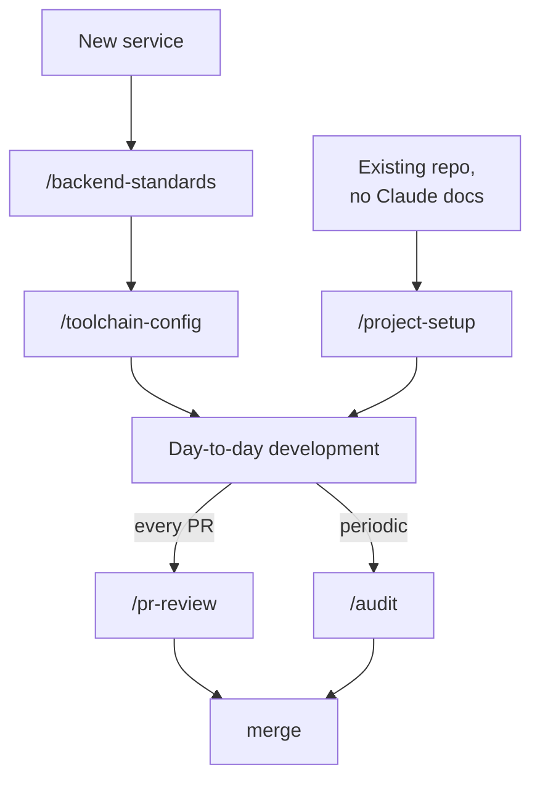

# Using the skills

How to invoke each skill, what it asks for, and what it produces. Install first (see
[`README.md`](README.md) § Install), then start a new Claude Code session.

## Invoking a skill

Two equivalent ways:

- **Explicit:** type `/` + the skill's name — `/backend-standards`, `/toolchain-config`,
  `/project-setup`, `/pr-review`, `/audit`. The name is the `name:` field in the skill's
  `SKILL.md`, not the folder path (they happen to match here).
- **Natural language:** describe the task; the model matches it to a skill's `description`
  (e.g. "create a new backend service for payments" → `backend-standards`).

Each `SKILL.md` opens with a **When to use** line, so you can confirm you picked the right
one at a glance.

---

## Lifecycle — how they chain

---

## `backend-standards`

- **When:** a new NestJS/TypeScript service, or bringing an existing one onto the standard.
- **Requires:** `toolchain-config` installed alongside it (it invokes it at step 3).
- **New service** — it asks up front (sensitivity, versioning strategy, released mobile
  client?, external systems, webhooks, money), then: `nest new` → install deps → apply
  toolchain → copy the standards into `.ai/standards/` → write `CLAUDE.md` → copy only the
  source templates the service needs → copy the two agents → fill `03` → run every gate →
  wire CI → stamp the version → report.
- **Existing service** ("apply our backend standards to this repo") — documents what the
  project **actually is**, records intentional differences in `known-deviations.md`,
  installs the two agents. Does **not** rewrite working code.
- **Note:** the Nest CLI is pinned to 11; Nest 12 is not yet supported (see the skill's
  § "Nest 12").

## `toolchain-config`

- **When:** unify ESLint / Prettier / tsconfig / Husky / lint-staged on a NestJS/TS repo.
- **How it runs:** an interactive **diff-and-ask** flow — it shows each file's diff and
  asks per file before writing; nothing is overwritten silently. On a brand-new project
  you can approve the whole set at once.
- Preserves project-specific `baseUrl`/`paths`/`include`/`exclude` and any project hook
  commands. Never runs `npm install` on its own.

## `project-setup`

- **When:** set up or migrate a backend repo for Claude Code and Codex (fresh, v1, hand-written, or
  update). Shared `AGENTS.md`, `CLAUDE.md` importing it, shared `reviewer`/`docs-sync` agents.
- **How it runs:** Phase 0 discovery, then a hard stop; drafts only; you approve the diff by its plan
  hash; `commit` applies exactly that plan, with backups and a verified rollback. Never reads secret
  files. Details and known limitations: `project-setup/README.md`, `project-setup/RELEASE-NOTES-2.0.0.md`.

## `pr-review` — per-PR gate

Reviews **one diff** across three lanes — automated scanners, the project's reviewer agent
with security checks, and a quality pass — and returns one severity-ranked report with a
blocking verdict.

**Argument forms** (`/pr-review <arg>`):

| Argument              | What it reviews                                                  |
| --------------------- | ---------------------------------------------------------------- |
| a PR URL or `#number` | `gh pr diff <n>` — and pulls the PR title/description for intent |
| a branch name         | `git diff <base>...<branch>`                                     |
| file paths            | just those paths against base                                    |
| _(nothing)_           | `git diff <base>...HEAD` — current branch vs its base            |

It detects the base branch (does not assume `main`), reviews only what changed, labels each
scanner hit by confidence, and never auto-fixes or commits.

## `audit` — full-codebase safety net

Scans the **entire codebase** (not a diff) and **persists** findings to
`docs/security/scan-report-<date>.md`, mirroring Critical/High into `TODO.md` so they stay
trackable. It respects accepted risks recorded in `TODO.md` / `.ai/decisions/`.

### Options

| Option              | Effect                                                                                                                                       |
| ------------------- | -------------------------------------------------------------------------------------------------------------------------------------------- |
| _(none)_            | **`security-first`** — the default. Runs only the Security lane (checks S1–S12). Fast, low-noise, safe to run often.                         |
| `--full`            | Runs **all** lanes: Security **+ Q**uality **+ P**erformance/DB **+ T**ests **+ D**ependencies/CVE **+ O**bservability. The true safety net. |
| `--path <dir>`      | Scope the scan to a subtree instead of the whole repo.                                                                                       |
| `--since <git-ref>` | Scan only files changed since a git ref — catch-up mode for "what merged unreviewed".                                                        |

Options combine, e.g. `/audit --full --since origin/main` (all lanes, only what changed
since `origin/main`), or `/audit --path src/payments` (security-only, one subtree).

**What each `--full` lane covers**

| Lane                      | Looks for                                                                                                                                                                                            |
| ------------------------- | ---------------------------------------------------------------------------------------------------------------------------------------------------------------------------------------------------- |
| **S** — Security (always) | PII in logs, hard-coded secrets, SQL/NoSQL injection, unvalidated input, unguarded routes, missing rate-limits, broken auth/IDOR, weak crypto, SSRF/path-traversal, exposed errors, missing timeouts |
| **Q** — Quality           | duplication, dead code, oversized units, SOLID violations, `any`                                                                                                                                     |
| **P** — Performance/DB    | N+1, unbounded/unindexed queries, blocking I/O, cache stampede, Redis TTL/atomicity, transaction scope                                                                                               |
| **T** — Tests             | modules with zero tests, critical paths (auth/money) uncovered, skipped tests                                                                                                                        |
| **D** — Dependencies      | `npm audit` / `osv-scanner` etc. — Critical/High CVEs, `*`/`latest` pins                                                                                                                             |
| **O** — Observability     | missing logging/correlation IDs, silent catches, stray `console.log`, no metrics on money/auth                                                                                                       |

`audit` never echoes secret values (type + location only), never auto-fixes, and never
commits.

---

## Notes

- `pr-review` and `audit` are framework-agnostic and lean on real scanners
  (`gitleaks`/`trufflehog`, `semgrep`, `osv-scanner`, `npm audit`, `tsc`). If a scanner is
  not installed they say so and lower the report's confidence rather than skipping silently
  — install the ones you rely on in CI.
- None of the skills auto-fix or commit. They report; you act.
